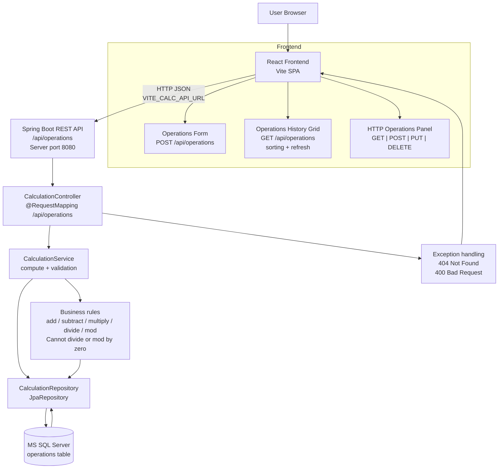

# Project Architecture

## 1) Production-style architecture

The system is a two-layer application:

- **Frontend**: React + Vite SPA (`src/`) served from the Vite dev or preview server.
- **Backend**: Spring Boot API (`my-react-service/`) with REST endpoints.
- **Data layer**: Microsoft SQL Server accessed via Spring Data JPA.

### Runtime topology

### Backend responsibilities

- Exposes CRUD endpoints for operations:
  - `POST /api/operations` -> create and persist calculation
  - `GET /api/operations` -> return history
  - `GET /api/operations/{id}` -> return one item
  - `PUT /api/operations/{id}` -> update operands, operation, and result
  - `DELETE /api/operations/{id}` -> remove record
- Validates request payload using bean validation.
- Computes result in the service layer and persists the domain entity.
- Returns response DTOs for UI consumption.
- Handles errors:
  - missing record -> `404`
  - invalid operation, divide-by-zero, or mod-by-zero -> `400`

### Data model

- Entity: `Calculation`
  - `id`
  - `first_number`
  - `second_number`
  - `operation`
  - `result`
- `operation` is one of: `add`, `subtract`, `multiply`, `divide`, `mod`.
- `DatabaseSchemaInitializer` creates `operations` table at startup if it is missing.

### Build and run path

- Backend:
  - `my-react-service/build.gradle`
  - `my-react-service/settings.gradle`
  - `my-react-service/gradlew.bat`
  - Spring Boot app at `my-react-service/src/main/java/com/example/calculator/...`
- Frontend:
  - Vite app at repo root
  - Entry: `src/main.tsx`
  - Main view: `src/App.tsx`

### Environment and ports

- Frontend base API URL comes from:
  - `VITE_CALC_API_URL` with fallback `http://localhost:8080`
- Backend SQL Server connection comes from:
  - `SQLSERVER_URL`
  - `SQLSERVER_USERNAME`
  - `SQLSERVER_PASSWORD`
  - optional Windows auth flag

### Typical data flow

1. User enters values and an operation in the frontend.
2. Frontend sends `POST /api/operations`.
3. Controller validates the request and calls the service.
4. Service resolves the operation and computes the result, including `mod`.
5. Service persists `Calculation` via the repository.
6. Service returns a response DTO.
7. Frontend displays the result and refreshes the history grid.
8. User can sort the history grid locally by id, numbers, operand, or result.

### Notes

- The codebase also contains local run scripts such as `backend-start.bat` and `frontend-start.bat`.
- Frontend end-to-end coverage is implemented with Playwright under `tests/e2e/`.
- Frontend automation runners live under `scripts/`.
