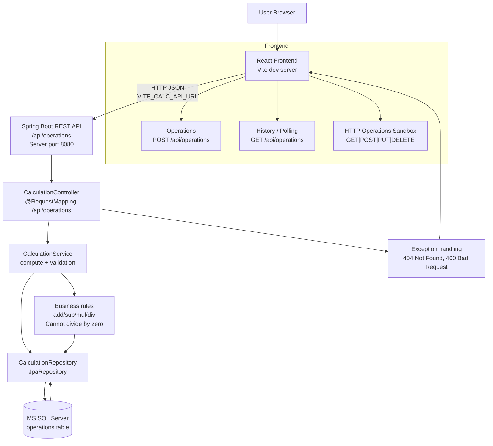

# Project Architecture

## 1) Production-style architecture

The system is a two-layer application:

- **Frontend**: React + Vite SPA (`src/`) served from Vite dev/preview server.
- **Backend**: Spring Boot API (`backend/`) with REST endpoints.
- **Data layer**: Microsoft SQL Server accessed via Spring Data JPA.

### Runtime topology

### Backend responsibilities

- Exposes CRUD endpoints for operations:
  - `POST /api/operations` → create and persist calculation
  - `GET /api/operations` → return history
  - `GET /api/operations/{id}` → return one item
  - `PUT /api/operations/{id}` → update operands/operation and result
  - `DELETE /api/operations/{id}` → remove record
- Validates request payload using bean validation.
- Computes result in service layer and persists domain entity.
- Returns response DTOs for UI consumption.
- Handles errors:
  - missing record ⇒ `404`
  - invalid operation or divide-by-zero ⇒ `400`

### Data model

- Entity: `Calculation`
  - `id`
  - `first_number`
  - `second_number`
  - `operation`
  - `result`
- `operation` is one of: `add`, `subtract`, `multiply`, `divide`.
- `DatabaseSchemaInitializer` creates `operations` table at startup if it is missing.

### Build and run path

- Backend:
  - `backend/pom.xml`
  - Spring Boot app at `backend/src/main/java/com/example/calculator/...`
- Frontend:
  - Vite app at repo root
  - Entry: `src/main.tsx`
  - Main view: `src/App.tsx`

### Environment and ports

- Frontend base API URL comes from:
  - `VITE_CALC_API_URL` (default fallback: `http://localhost:8080`)
- Backend SQL Server connection from:
  - `SQLSERVER_URL`
  - `SQLSERVER_USERNAME`
  - `SQLSERVER_PASSWORD`
  - optional Windows auth flag

### Typical data flow

1. User enters values and operation in frontend.
2. Frontend sends `POST /api/operations`.
3. Controller validates request and calls service.
4. Service resolves operation and computes result.
5. Service persists `Calculation` via repository.
6. Service returns response DTO.
7. Frontend displays result and refreshes history.

### Notes

- The codebase also contains batch scripts (`backend-start.bat`, `frontend-start.bat`) for local run flows.
- Scripted logs show backend can run on a non-default port when needed (e.g., port 8081 fallback).
