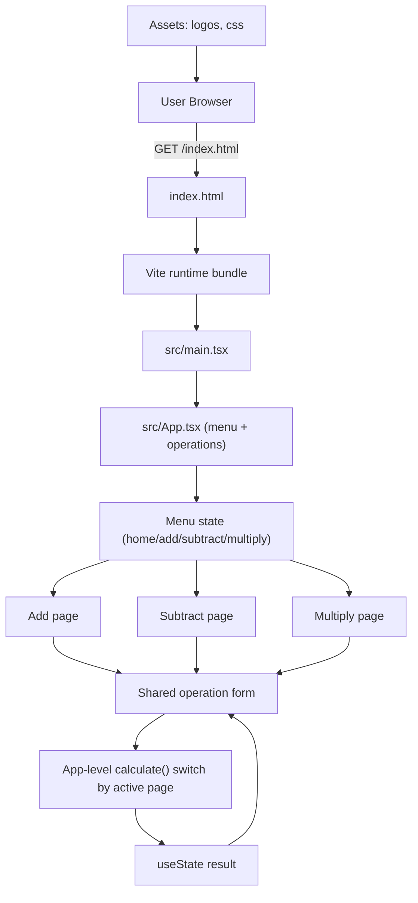

# Architecture Overview

## High-level view

## Core runtime files

- `index.html` hosts the app shell and points to `src/main.tsx`.
- `src/main.tsx` mounts React at `#root`.
- `src/App.tsx` controls:
  - top-level menu navigation
  - shared form input state
  - operation execution for add/subtract/multiply
  - result rendering
- `src/App.css` / `src/index.css` provide component and base styles.

## Tooling and execution

- `package.json` scripts wire:
  - `dev` -> Vite dev server
  - `build` -> production bundle
  - `test` -> Vitest + jsdom
  - `lint` -> ESLint
- `vite.config.js` enables React plugin and test environment setup.
- `src/test/setup.ts` loads testing matchers.
- `src/App.test.tsx` verifies menu switching and calculation behavior.
- `tsconfig.json` provides TypeScript compiler settings.

## Data flow (per user action)

1. User picks a page from the menu.
2. `activePage` updates the selected operation.
3. User enters numbers and submits the shared form.
4. `App.tsx` parses values, applies operation logic, and stores `result` in state.
5. UI re-renders with the page-specific label and computed value.
